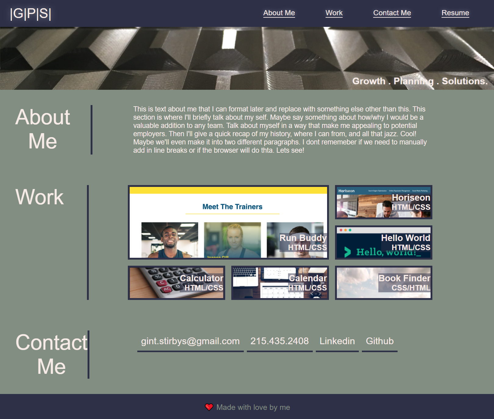

#  **Portfolio Site/Weekly-Challenge-2**

This is the second weekly challenge for the UPENN LPS Coding bootcamp.  The project required us to make a portfolio site from scratch that can be used in the future to exhibit our work/resume.  

## **Link**

Link to the deployed site:
> 

Link to github repository:
> 

## **Motivation**
This was the first time building a site from the ground up.  The assignment proved to be very daunting and difficult but provided ample opportunities to learn and grow as a novice web developer.  I look forward to revisiting this project in the future in order to make many improvements as I acquire new skills.  

## **Build Status**

This is __very__ __much__ a work in progress.  

## **Code Style**

This project used basic HTML with some slightly more advanced CSS elements such as CSS Grid, flexbox, transition, and, animation.  

## **Screenshots**  
This is a photo of the deployed site:

## **Tech Used**

- Built With
    - [VS Code](https://code.visualstudio.com/)
    - [Lighthouse](https://developers.google.com/web/tools/lighthouse/)
    - [Wave](https://wave.webaim.org/)
    - [Carbon](https://carbon.now.sh/)
    - [GoFullPage](https://gofullpage.com/)
    - [Coolors](https://coolors.co/)

## **Credits**

Thanks to UPennLPS Coding Bootcamp.  Thank you to the bootcamp instructors and TA's for all their help along the way ❤.  

